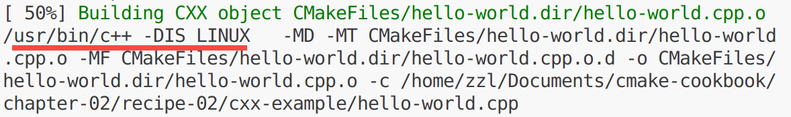
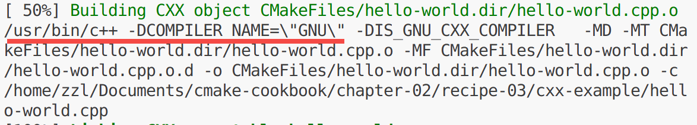
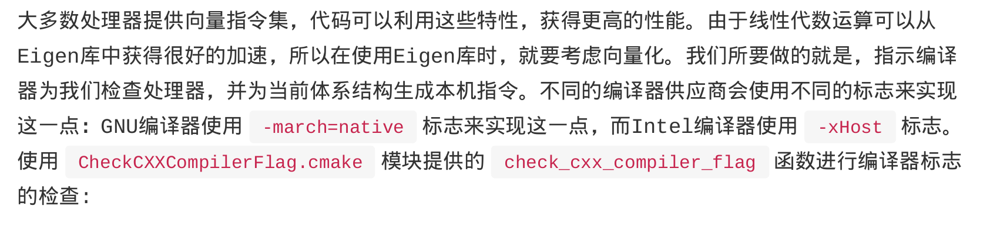

## 2.1 检测操作系统  
使用CMAKE_SYSTEM_NAME变量  
## 2.2 根据系统添加宏定义  
核心代码如下：  
if(CMAKE_SYSTEM_NAME STREQUAL "Linux")  
  target_compile_definitions(hello-world PUBLIC   "IS_LINUX")  
endif()  

**CMake实现添加宏定义的方法不是在源代码中添加宏定义，而是使用编译器的选项来添加宏定义**  
使用make VERBOSE=1即可查看详细输出，即红线处标记的 c++ -D IS_LINUX  
编译器会在预处理阶段把这个宏定义添加上  

## 2.3 处理与编译器相关的源代码  
target_compile_definitions(hello-world PUBLIC "COMPILER_NAME=\"\${CMAKE_CXX_COMPILER_ID}\"")  
target_compile_definitions(hello-world
  PUBLIC "IS_${CMAKE_Fortran_COMPILER_ID}_FORTRAN_COMPILER"
)  
这里还是使用宏定义的方式告诉代码编译器类型：  

## 2.4 检测处理器体系结构  
CMAKE_SIZEOF_VOID_P： 空指针大小，单位字节，8字节代表64位cpu  
CMAKE_HOST_SYSTEM_PROCESSOR： 处理器架构  
## 2.5 检测处理器指令集
这里使用生成config.h的方法，让cmake填充头文件的宏定义来告诉代码指令集类型    
写一个config.h.in文件，然后使用@var@或\${var}格式解引用变量  
第一步，查询需要变量的值：  
cmake_host_system_information(RESULT \_${key} QUERY ${key})  
注意代码中含有一个下划线_  
这行代码的意思是查询**OS_NAME**的值，并且存储到_OS_NAME变量中，后面能与**config.h.in**对应上  

第二步,通过config.h.in生成config.h文件：  
configure_file(config.h.in config.h @ONLY)  
@ONLY的作用是只识别@var@格式的变量进行替换  
默认情况下两种格式都能识别然后进行替换  
## 2.6 检测编译器是否支持某些标志  
核心代码：  
check_cxx_compiler_flag("-march=native" _march_native_works)  
这行代码的含义是检测编译器是否支持-march=native这个标志，并且把检测结果true或false存入_march_native_works这个变量  
check_cxx_compiler_flag()这个模块不是默认带的  
需要导入CheckCXXCompilerFlag.cmake 标准模块文件：  
include(CheckCXXCompilerFlag)  
接下来就可以根据需求进行操作了，例如添加编译的选项：  
set(_CXX_FLAGS "-march=native")  

使用场景：  
