# riscv
## Q&A
riscvbook中文版：http://riscvbook.com/chinese/RISC-V-Reader-Chinese-v2p1.pdf  
riscv参考文档：https://riscv.org/technical/specifications/  

`ISA是什么？`:Instruction Set Architecture 指令集架构  
ISA 包括了计算机处理器能够执行的指令集合、寄存器的数量和功能、内存访问方法等方面的规范。
`riscv指令格式有哪些?`:在编译器层面不用考虑指令内部的编码格式    
`ABI是什么?`:Application Binary Interface 应用程序二进制接口  

## RISC-V基础指令集
RISC-V的核心(core)包含一个基础指令集(Base Instruction Set)，基础指令集有如下几种:
  - RV32I: 32位整型指令集，指令长度32bit，32个32bit通用寄存器
  - RV32E：基于RV32I简化，用于嵌入式CPU，只有16个通用寄存器，其它和RV32I一样
  - RV64I: 基于RV32I变化，支持64bit地址空间，寄存器变为64bit宽，对RV32I指令格式进行了部分修改。
  - RV128I：基于RV64I变化，支持128bit地址空间，寄存器变位128bit宽.
  - RV32E,RV64I,RV128I相对于RV32I的变化非常小，因此嵌入式软件工程师入门RISC-V，只需要先掌握RV32I指令集即可。

## RISC-V扩展指令集
在RISC-V的协处理器(accelerator)提供的功能由扩展指令集(Extension Instruction Set)描述。下面列出一些主要的扩展指令集：

  - M: 乘法扩展，提供乘法和除法指令
  - A: 原子操作扩展
  - F: 单精度浮点扩展
  - D：双精度浮点扩展
  - Q: 四精度浮点扩展
  - L: 十进制浮点扩展
  - C: 压缩指令扩展, 将指令压缩位16bit
  - B: 位操作扩展
  - J: 动态翻译扩展，例如java的动态检查和垃圾回收可以得到ISA的硬件支持
  - P: 单指令多数据流扩展(SIMD)
  - V: 向量操作扩展

## Register definition  
前面我们知道ISA包括定义指令集、寄存器、访存方式等  
所以寄存器有哪些，可以怎么使用，对于编译器来说是一个很重要的部分  
我认为寄存器部分应该先于指令集去了解  

riscv有31个寄存器和一个0寄存器：  
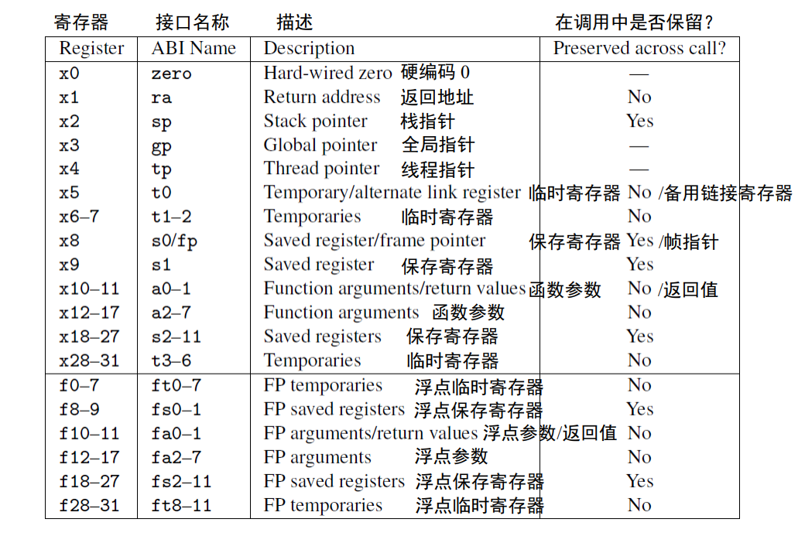  

寄存器具体用法应该查阅ABI文档  
拓展阅读：riscv calling convention https://riscv.org/wp-content/uploads/2015/01/riscv-calling.pdf  
riscv calling convention中的寄存器表格：  
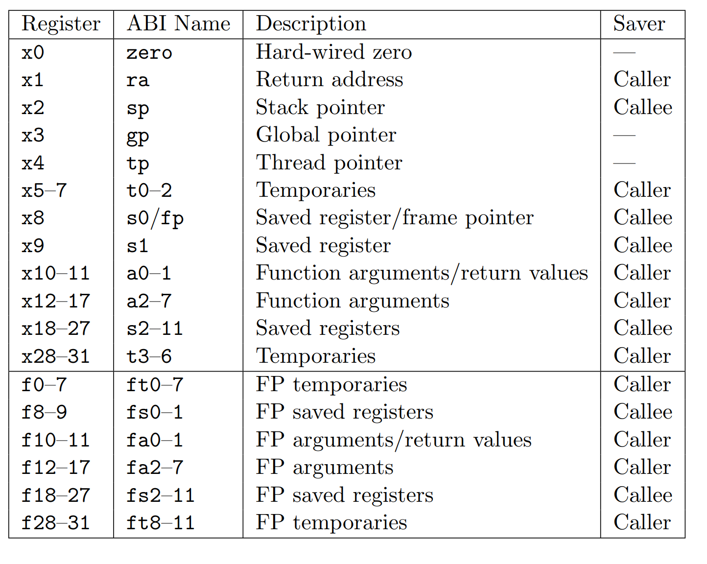  

`Q:在这里我注意到最后一列的表示不太一样，最后一列的作用是什么？为什么要规定寄存器的saver？`
> 我的理解，在编译器的设计过程中需要通过该ABI来设计函数调用的过程，具体来说，函数调用时，编译器要做的工作是把caller函数的状态寄存器保存起来，把callee的状态寄存器设置好，这个操作对用户是无感的。这个ABI就使得编译器设计时能确定哪些状态寄存器的值需要保存记录，哪些不需要，这些状态寄存器的值默认也是存储在栈里  

`Q:函数调用规范calling convertion和ABI有什么区别和联系？`  
`Q:ABI具体是干什么用的?给谁用的?`  
> 我的理解，ABI就是规定了寄存器的用法，主要是编译器在实现函数调用或操作系统实现进程上下文切换时需要参考  

#### 根据上图,我们来看一个标准RV32I的函数入口和出口：  
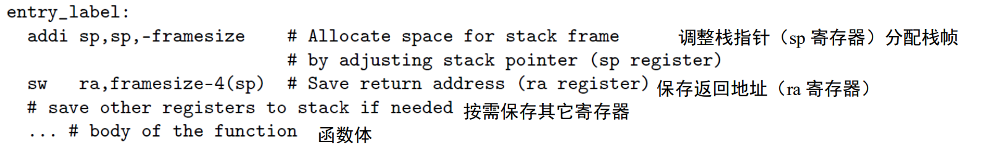  
这个是函数入口，接下来看函数出口：  
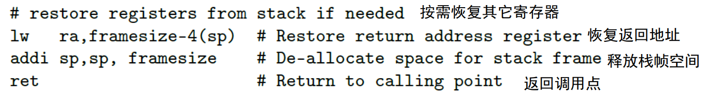  
`该示例不够明确,我不懂除了保存ra寄存器,具体还有哪些寄存器需要按需保存,是否需要根据上表最后一列所示进行保存`  

## 汇编器  
riscv汇编指示符:  
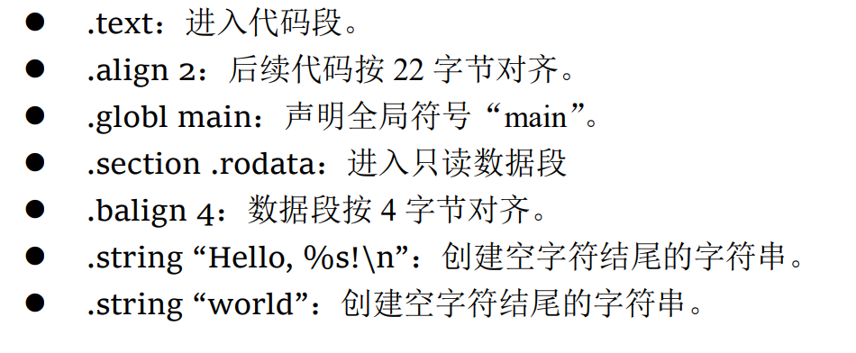  

依赖于x0的伪指令：  
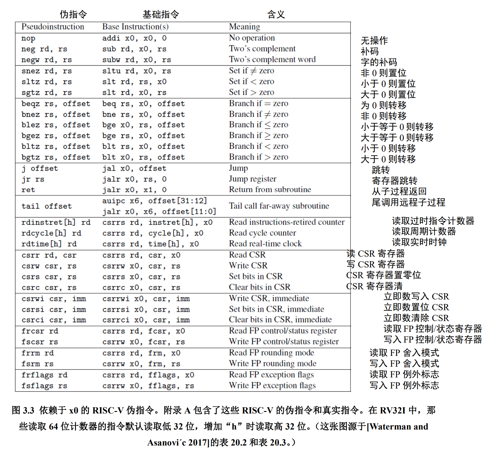  

不依赖于x0的伪指令：  
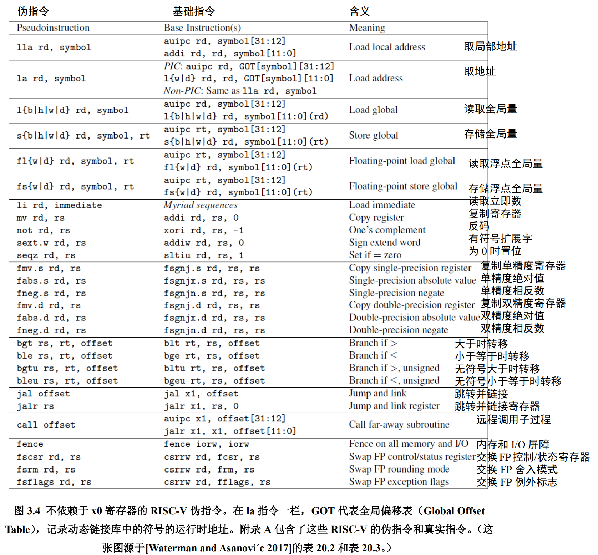  

汇编代码示例：  
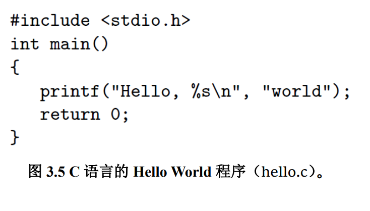  
汇编：
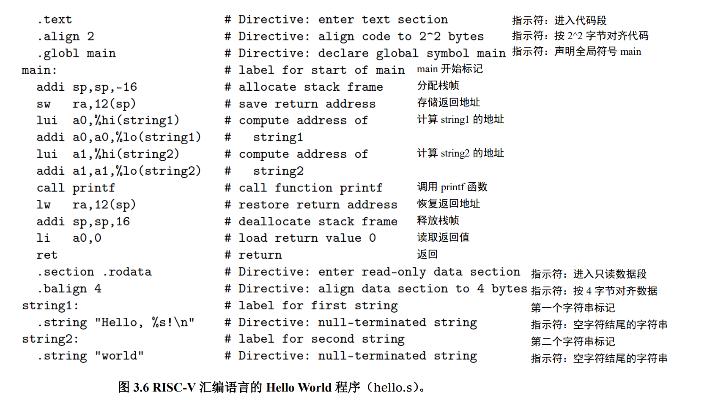  
编译：
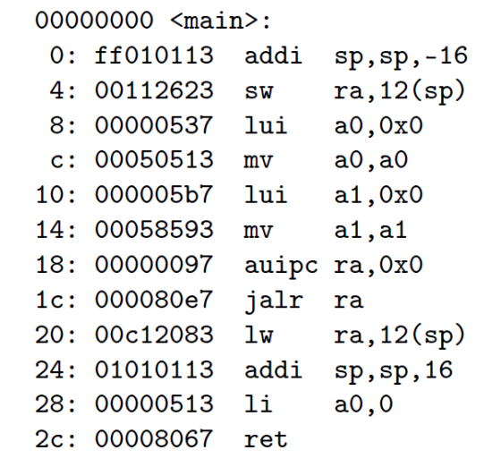  

`Q:为什么要使用lui(load upper immediate)和addi两个指令结合才能加载一个完整的立即数？`  
首先，我们晒出riscv指令格式：  
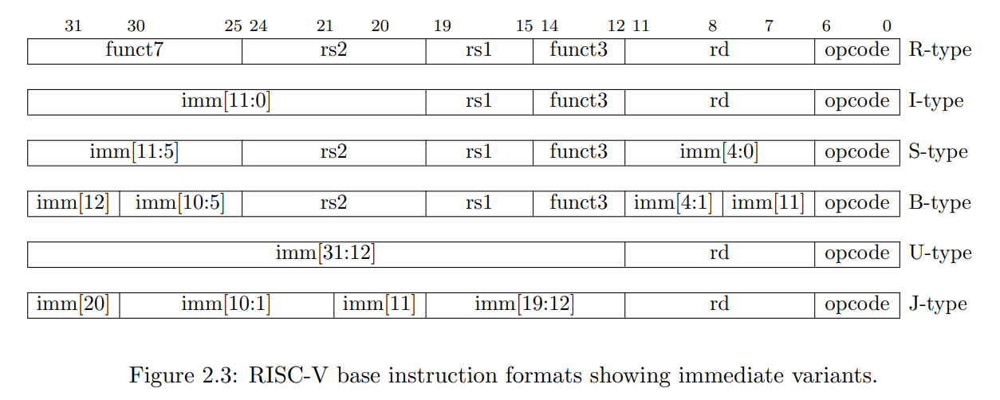  
然后以lui指令为例，查看文档：  
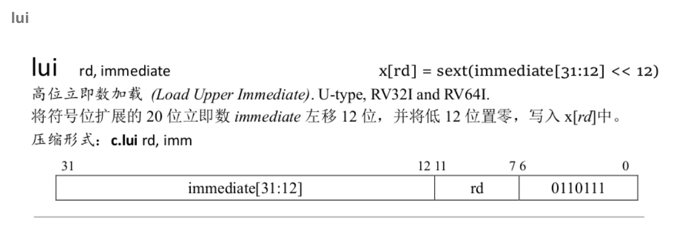  

可以看到，lui指令是U型指令，只有20位可以存储立即数  
riscv的指令长度只有32位，要想加载一个32位的立即数，自然需要两个指令拼在一起使用  

链接： 
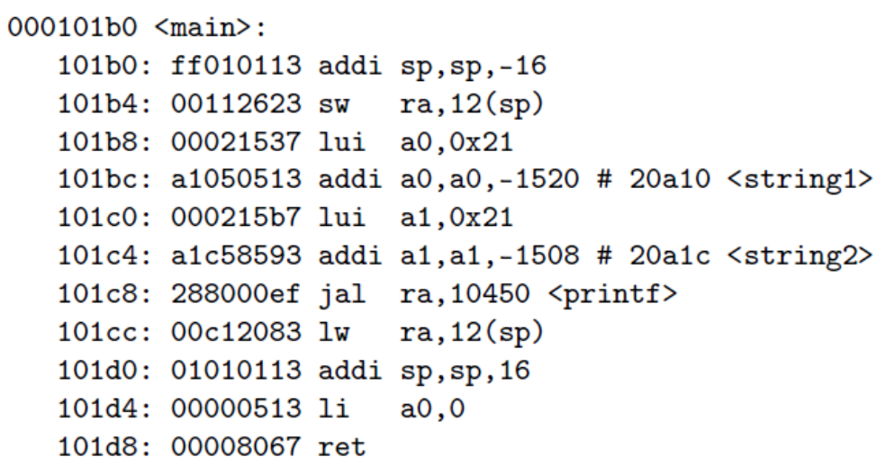  

常见汇编指示符：
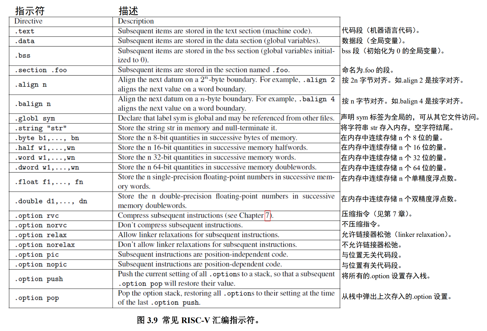  

## RV32I基础整数指令集  
RISCV reference card RV32I部分截图：
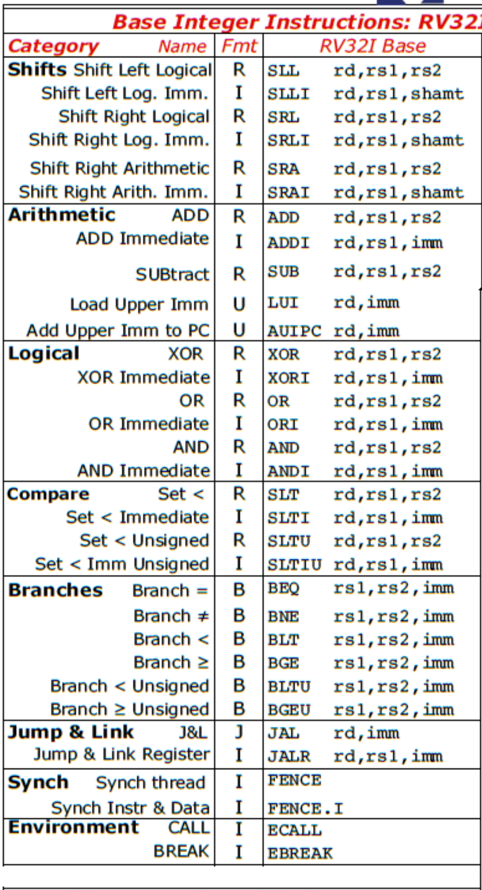  
这里可以清晰的看到RV32I的指令有这几大类，非常精简，其中下面jump and link指令是最常用的指令之一，fence ecall ebreak指令就可以先忽略，这几个主要是操作系统用的  
RV32I指令图示，将指令进行了归纳分类：  
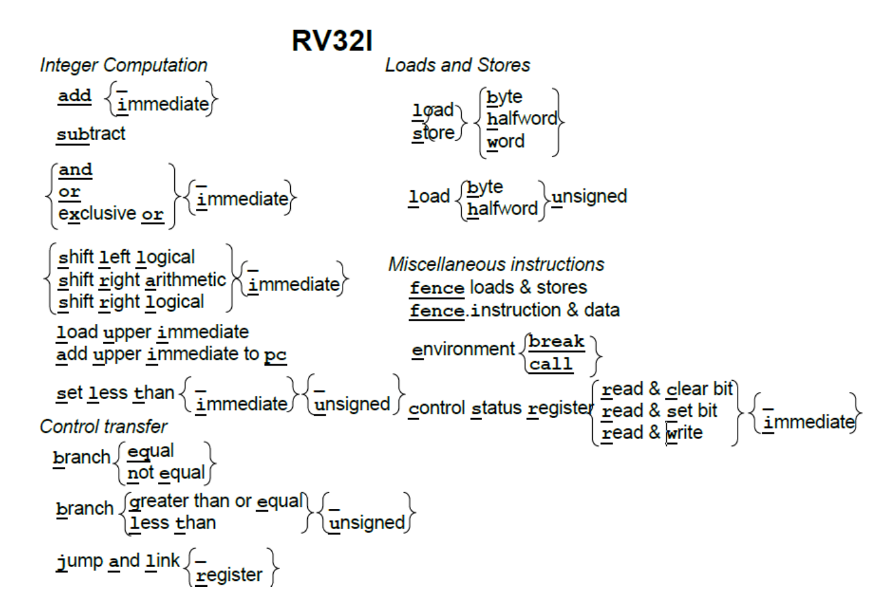  
